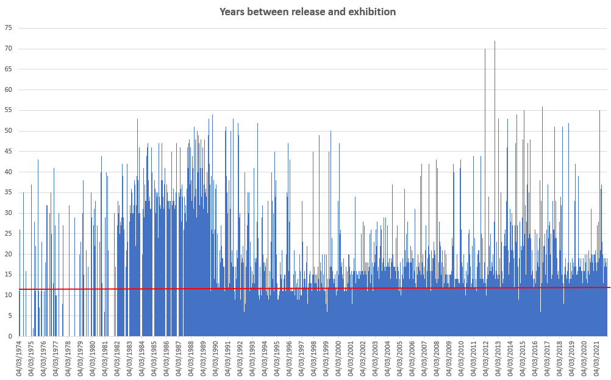
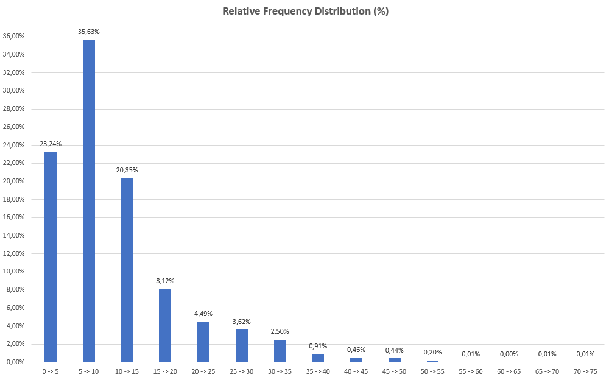
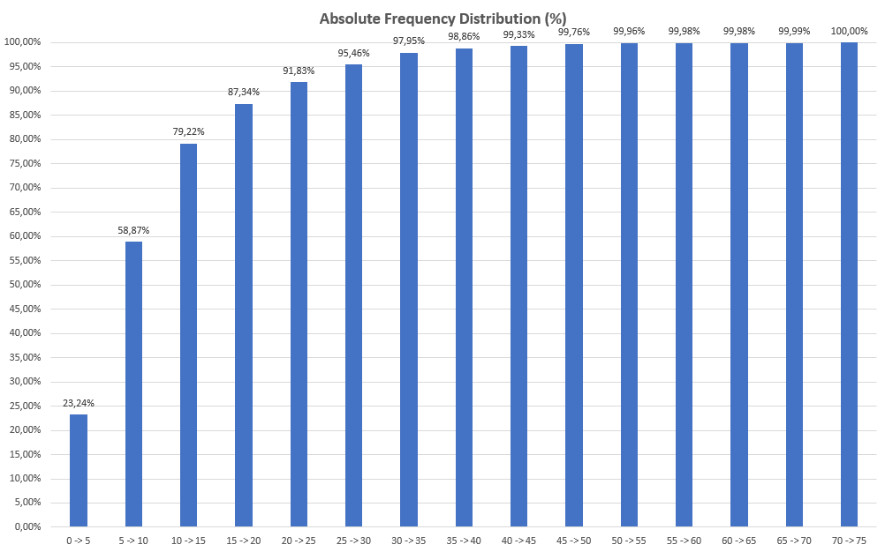

<h1>Analysis</h1>

This is the final part of our study, it time to cross all data we got and input some analysis. 

Keeping the logic, i create the schema ANALYSIS to separate the analysis tables from others.

````sql
create schema ANALYSIS
go
````

<b>It is important to notice that some data comes different than expected, a lot of nulls, blanks and contradictions appears. Some results may change as long as i improve my extraction methods</b>    

<hr>

<h3>#1 Years between exhibition date and release date</h3> 

Variables in use:

* Exhibition Date `(MODEL.T_Exibicao)`
* Release Date ()

We will create a table called `Analysis.T_case1` 

`````sql
create table ANALYSIS.T_case1(
	DataExibicao varchar(20),
	Dif_anos int
)
go
`````

Inserting existing data

````sql
declare 
	@DataExibicao varchar(50),
	@Dif_anos int

declare customCursor cursor LOCAL FAST_FORWARD for 
		(select E.DataExibicao, 
		CAST(RIGHT(E.DataExibicao,4) AS int) - CAST(RIGHT(F.Lancamento,4) AS int) 'Diferença'
		from MODEL.T_Exibicao E
			inner join (select IDFilme,Lancamento from MODEL.T_Filmes 
			where Lancamento <> 'null' and Lancamento <> '' and Lancamento <> 'Ver tudo') F on
			(E.ID_Filme = F.IDFilme) )


open customCursor

fetch next from customCursor
into @DataExibicao, @Dif_anos

WHILE @@FETCH_STATUS = 0
BEGIN

	if @Dif_anos > 0 and @Dif_anos < 80
		insert into ANALYSIS.T_case1 values (@DataExibicao,@Dif_anos)

	fetch next from customCursor
	into @DataExibicao, @Dif_anos

END

	close customCursor
	deallocate customCursor

GO
````

`Dif_anos` represents the years between exhibition date and release date. Let's observe how `Dif_anos` extends in time. 



In average, `Rede Globo Television` exhibits approximately a 11 years old movie every day. The oldest movie exhibited has 72 and the youngest 1 year. 



Looking at Relative Frequency Distribution, we see a higher concentration of movies on 5 - 10 interval.



