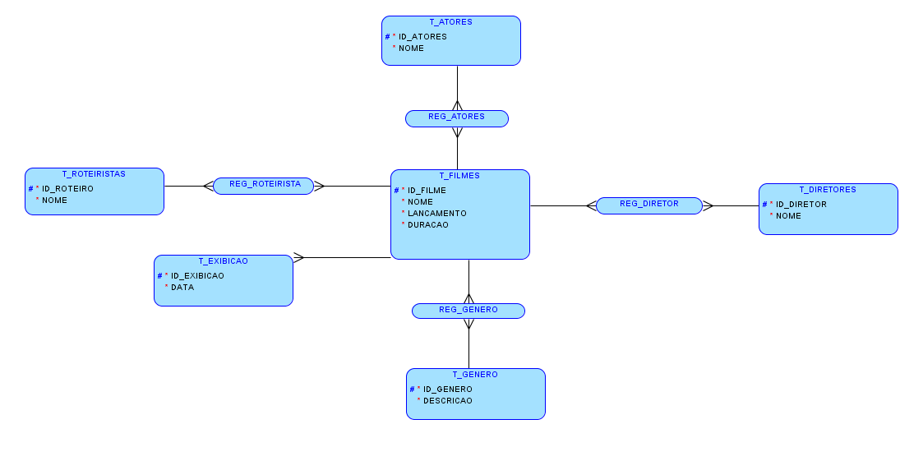

<h1>Modeling</h1>

We can not tell much about exhibition date and movie name. In order to expand our analysis, i added the following relational model:



I decided to add actors, directors, screen players and other informations related to movies. Every movie has one or more directors likewise actors, screen players and gender. This section is dedicated to get these information and adapt then to our model.

<h3>Creating MODEL Tables</h3>

Before we start, we going to create our model tables. To separate these kind of tables, i create the schema MODEL. The script below shows with more details the creation process. 

````sql
-- Creating schema

create schema MODEL
go

-- Creating Movies Table

create table MODEL.T_Filmes(
	IDFilme int primary key,
	NomeFilme varchar(300),
	Lancamento varchar(50),
	Duracao varchar(20)
)
go

-- Creating Actors Table

create table MODEL.T_Atores(
	IDAtor int primary key,
	NomeAtor varchar(200)
)
go

-- Creating Auxiliary Actors Table

create table MODEL.REG_Atores(
	ID_Filme int,
	ID_Ator int
)
go

alter table MODEL.REG_Atores add constraint FK_REG_FILME_ATOR
foreign key(ID_Filme) references MODEL.T_Filmes(IDFilme)
go

alter table MODEL.REG_Atores add constraint FK_REG_ATOR
foreign key(ID_Ator) references MODEL.T_Atores(IDAtor)
go

-- Creating Directors Table

create table MODEL.T_Diretores(
	IDDiretor int primary key,
	NomeDiretor varchar(200)
)
go

-- Creating Auxiliary Directors Table

create table MODEL.REG_Diretores(
	ID_Filme int,
	ID_Diretor int
)
go

alter table MODEL.REG_Diretores add constraint FK_REG_FILME_DIR
foreign key(ID_Filme) references MODEL.T_Filmes(IDFilme)
go

alter table MODEL.REG_Diretores add constraint FK_REG_DIR
foreign key(ID_Diretor) references MODEL.T_Diretores(IDDiretor)
go

-- Creating Screen Players Table

create table MODEL.T_Roteiristas(
	IDRoteirista int primary key,
	NomeRoteirista varchar(200)
)
go

-- Creating Auxiliary Screen Players Table

create table MODEL.REG_Roteiristas(
	ID_Filme int,
	ID_Roteirista int
)
go

alter table MODEL.REG_Roteiristas add constraint FK_REG_FILME_ROT
foreign key(ID_Filme) references MODEL.T_Filmes(IDFilme)
go

alter table MODEL.REG_Roteiristas add constraint FK_REG_ROT
foreign key(ID_Roteirista) references MODEL.T_Roteiristas(IDRoteirista)
go

-- Creating Genders Table

create table MODEL.T_Generos(
	IDGenero int primary key,
	NomeGenero varchar(100)
)
go

-- Creating Auxiliary Genders Table

create table MODEL.REG_Generos(
	ID_Filme int,
	ID_Genero int
)
go

alter table MODEL.REG_Generos add constraint FK_REG_FILME_GEN
foreign key(ID_Filme) references MODEL.T_Filmes(IDFilme)
go

alter table MODEL.REG_Generos add constraint FK_REG_GEN
foreign key(ID_Genero) references MODEL.T_Generos(IDGenero)
go

-- Creating Exhibition Table

create table MODEL.T_Exibicao(
	IDExibicao int primary key identity,
	ID_Filme int,
	DataExibicao varchar(20)
)
go

alter table MODEL.T_Exibicao add constraint FK_FILME_EXI
foreign key(ID_Filme) references MODEL.T_Filmes(IDFilme)
go


````

 

<h3>Creating insert procedures</h3>

As well as we did in RAW table, we will create insert procedures for our MODEL tables.

````sql
-- Creating procedure to insert movies data 

create proc inserirMovies
	@ID int,
	@NomeFilme varchar(300),
	@Lancamento varchar(50),
	@Duracao varchar(20)
as
	insert into MODEL.T_Filmes values 
	(@ID,@NomeFilme,@Lancamento,@Duracao)
go

-- Creating procedure to insert actors names 

create proc inserirAtores
	@ID int,
	@NomeAtor varchar(300)
as
	insert into MODEL.T_Atores values 
	(@ID,@NomeAtor)
go

-- Creating procedure to insert actors auxiliary data

create proc inserirRegisterActor
	@IDFilme int,
	@IDAtor int
as
	insert into MODEL.REG_Atores values 
	(@IDFilme,@IDAtor)
go

-- Creating procedure to insert directors names

create proc inserirDiretores
	@ID int,
	@NomeDiretor varchar(300)
as
	insert into MODEL.T_Diretores values 
	(@ID,@NomeDiretor)
go

-- Creating procedure to insert directors auxiliary data

create proc inserirRegisterDirector
	@IDFilme int,
	@IDDiretor int
as
	insert into MODEL.REG_Diretores values 
	(@IDFilme,@IDDiretor)
go

-- Creating procedure to insert screen players names

create proc inserirScreenPlay
	@ID int,
	@NomeRoterista varchar(300)
as
	insert into MODEL.T_Roteristas values 
	(@ID,@NomeRoterista)
go

-- Creating procedure to insert screen players auxiliary data

create proc inserirRegisterScreenPlay
	@IDFilme int,
	@IDRoteiro int
as
	insert into MODEL.REG_Roteristas values 
	(@IDFilme,@IDRoteiro)
go

-- Creating procedure to insert gender types

create proc inserirGeneros
	@ID int,
	@NomeGenero varchar(300)
as
	insert into MODEL.T_Generos values 
	(@ID,@NomeGenero)
go

-- Creating procedure to insert gender auxiliary data

create proc inserirRegisterGender
	@IDFilme int,
	@IDGenero int
as
	insert into MODEL.REG_Generos values 
	(@IDFilme,@IDGenero)
go


````


<h3> The  MovieExtractor Program </h3>

Distinctly, we have 3438 movies in our database, how can we store each information ? Surely, it would take a while if we extract manually. Thus i developed a java program to solve this issue. 

How to start:

* Go to <a href="filmesSessaoDaTarde">Main folder</a> and click on `MovieExtractor.jar`

* Wait until a black painel shows up

  

* Go to `Action >> Extract films` to initiate the program

  

The program will read each movie name, searching in google all information we want (actors names, duration, release date and so on). The process itself takes <b>more than 12 hours</b> given all movies in our database.

 


When the program has been finished, we got all table's data in text format, as well all insert script located <a href="filmesSessaoDaTarde\java\src\app\log">on log folder</a>.

<hr>

See below some inserts examples

````sql
...

inserirAtores 5, 'Allie DeBerry'
go
inserirAtores 6, 'Brandon Mychal Smith'
go
inserirAtores 7, 'Charles Robinson'
go
inserirAtores 8, 'Glenn Morshower'
go

...

inserirDiretores 1548, 'David Jackson'
go
inserirDiretores 1549, 'Alberto Seixas Santos'
go
inserirDiretores 1550, 'Solveig Nordlund'
go
inserirDiretores 1551, 'Carl Franklin'
go

...

inserirGeneros 7, 'Fantasia'
go
inserirGeneros 8, 'Mistério'
go
inserirGeneros 9, 'Sobrenatural'
go
inserirGeneros 10, 'Humor ácido'

...
````


<h3>Filling MODEL Exhibit Table <h3>


We already have got the exhibition data on RAW table, however we need to pass the data to a model table to close our relational model. The following script shows the transfer process.


````sql
declare 
	@idFilme int,
	@filme varchar(300),
	@DiaMes varchar(50)

declare customCursor cursor LOCAL FAST_FORWARD for 
		(select DiaMes, NomeFilme from RAW.T_Filmes)


open customCursor

fetch next from customCursor
into @DiaMes, @filme

WHILE @@FETCH_STATUS = 0
BEGIN

	select @idFilme = IDFilme from MODEL.T_Filmes where NomeFilme = @filme
	
	insert into MODEL.T_Exibicao values 
	(@idFilme,@DiaMes)

	fetch next from customCursor
	into @id, @filme

END

	close customCursor
	deallocate customCursor

GO
````


